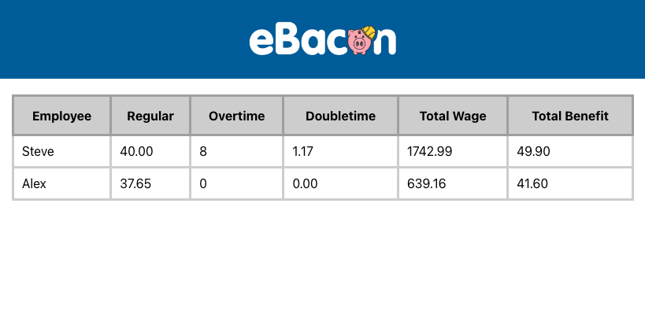
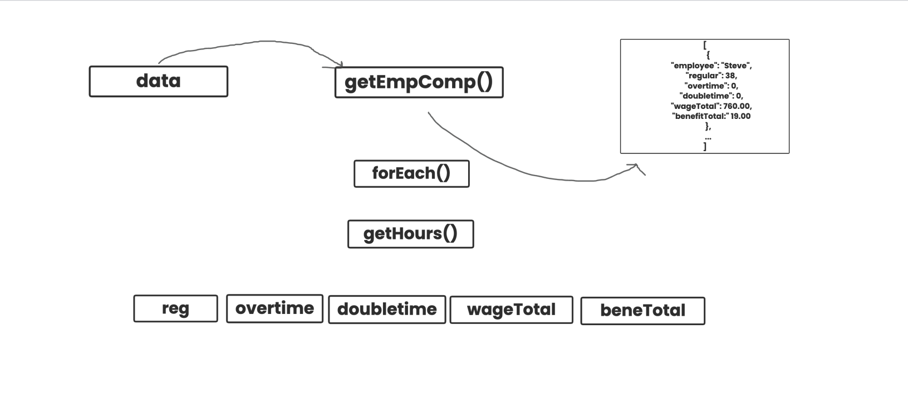

# Total Compensation Test solution

This is my solution to the Total Compensation Test.

## Table of contents

- [Overview](#overview)
  - [The challenge](#the-challenge)
  - [Screenshot](#screenshot)
  - [Links](#links)
- [My process](#my-process)
  - [Built with](#built-with)
  - [What I learned](#what-i-learned)
  - [Continued development](#continued-development)
  - [Useful resources](#useful-resources)
- [Author](#author)
- [Acknowledgments](#acknowledgments)

## Overview

### The challenge

- Using the provided JSON data below, process the data to
  determine the amount paid to each employee.

### Screenshot



## My process

### Build with

- [React](https://reactjs.org/) - JS library
- [SCSS](https://sass-lang.com/) - For styles

### What I learned

- Outline with pseudocode, break into small steps:



- Iterate through arrays of objects:

<h3>Iterate through each employee</h3>

````
```js
    data.employeeData.forEach(e => {
      let emp = getHours(e, e.employee, data.jobMeta)
      employeesComp.push(emp)
    })
    // console.log(employeesComp)
    return employeesComp;
  }
````

<h3>Iterate again through array of objects</h3>

````
```js
   employee.timePunch.forEach((t) => {
      jobData.forEach((val) => {
        ......
        }
      })
    })
````

### Useful resources

- Pseudocode Draw Tool: [https://app.seesaw.me/#/try/prompt/prompt.4e2cd12f-2311-44f5-b08b-9a4d8574ac19?ref=public_library]

- Learn more about eBacon: [https://www.ebacon.com/]

## Author

- Website: https://miajosephine.netlify.app/

## Acknowledgments

- Special thanks to Chris for pointing me to the right direction and bring clarifications to a confusing situation.
